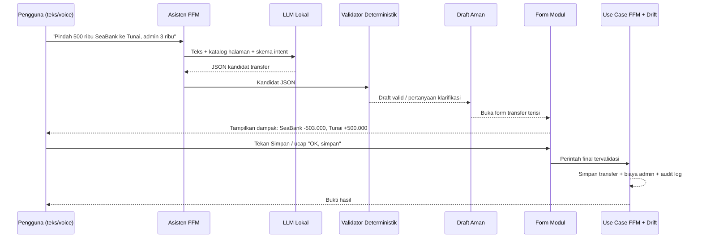

# Rancangan LLM Lokal Aman untuk Family Finance Manager

**Penulis:** Manus AI  
**Status:** Rancangan teknis—belum diterapkan ke APK  
**Tujuan:** Menambah pemahaman bahasa lokal yang lebih fleksibel tanpa memberi model hak untuk menulis data keuangan, mengubah saldo, atau melewati konfirmasi pengguna.

## Keputusan inti

> **Model bahasa adalah penerjemah dan perencana. FFM adalah satu-satunya pengambil keputusan serta pelaksana perubahan data.**

LLM lokal harus ditempatkan di belakang sebuah adapter yang hanya menerima teks dan mengembalikan **JSON intent terstruktur**. Adapter tersebut tidak boleh mengimpor Drift, repository, use case CRUD, `Navigator`, atau service ekspor. Sesudah model menjawab, sebuah validator deterministik FFM memeriksa setiap field, mengubah hasil menjadi draft, meminta klarifikasi bila data wajib belum lengkap, lalu hanya membuka form halaman terkait. Tombol simpan/form yang sudah ada tetap menjadi satu-satunya jalur persisten.

| Lapisan | Boleh dilakukan | Dilarang keras |
|---|---|---|
| LLM on-device | Memahami parafrasa, menyarankan intent, menguraikan teks panjang, menyusun kandidat JSON, dan menjelaskan alasan. | Menulis ke SQLite/Drift, menghitung saldo final, menjalankan transfer, membuat file ekspor, atau membuka halaman tanpa izin router. |
| Adapter LLM | Memuat model, menerapkan prompt sistem, membatasi token, dan meminta output JSON. | Meneruskan teks model sebagai kode Dart/SQL atau memanggil use case keuangan. |
| Validator intent FFM | Memvalidasi skema, normalisasi nominal, pencocokan rekening/kategori, dan deteksi ambigu. | Mengasumsikan nilai yang tidak disebut pengguna, terutama pihak, rekening, nominal, dan tanggal. |
| Draft manager | Menyimpan draft sementara lokal, membandingkan perubahan, dan mendukung koreksi/hapus/batal. | Menulis transaksi final tanpa tindakan eksplisit pengguna. |
| Form modul | Menampilkan preview terisi, informasi dampak saldo, dan tombol konfirmasi. | Menerima nilai model mentah tanpa validasi. |
| Use case FFM | Menjalankan aturan transfer, biaya admin, audit log, dan penyimpanan setelah konfirmasi. | Menerima akses langsung dari LLM/adapter. |

## Alur aman end-to-end



Tanpa langkah **“Tekan Simpan / OK, simpan”**, alur selalu berhenti di draft. Bahkan bila model mengeluarkan instruksi seperti `save=true`, validator harus membuang field tersebut. Ini mempertahankan kontrak v45: model boleh mengusulkan, tetapi FFM dan pengguna yang memutuskan.

## Kontrak JSON yang boleh dikeluarkan model

LLM tidak menghasilkan narasi bebas sebagai hasil eksekusi. Ia harus hanya menjawab satu objek yang tervalidasi terhadap JSON Schema lokal. Nilai yang tidak diketahui wajib `null`; model tidak boleh mengisi sendiri.

```json
{
  "schema_version": 1,
  "intent": "create_transfer",
  "confidence": 0.94,
  "arguments": {
    "amount": 500000,
    "from_account_phrase": "SeaBank",
    "to_account_phrase": "Tunai",
    "admin_fee": 3000,
    "occurred_at": "now",
    "note": null
  },
  "missing_fields": [],
  "assumptions": [],
  "explanation": "Membuat draft transfer dan biaya admin terpisah."
}
```

Validator kemudian mengonversi `from_account_phrase` menjadi ID rekening **hanya jika pencocokannya tunggal**. Jika terdapat dua rekening bernama mirip atau nama tidak tersedia, draft menjadi `needsClarification` dan asisten bertanya. Kontrak yang sama berlaku untuk hutang/piutang, target, ekspor, JSON, reminder, dan navigasi.

## Aturan keselamatan yang tidak boleh dinegosiasikan

| Keadaan | Perilaku wajib FFM |
|---|---|
| Nominal tidak disebut atau tidak pasti | Tanyakan nominal. Jangan gunakan tebakan/angka sebelumnya. |
| “Budi minjam 300 ribu” | Tanyakan arah uang: Budi berutang kepada keluarga atau keluarga berutang kepada Budi. |
| Transfer rekening sama | Tolak draft dan jelaskan alasannya. |
| Admin lebih besar dari atau sama dengan nilai transfer | Tampilkan peringatan keras dan minta koreksi/konfirmasi ulang. |
| Pengeluaran tanpa rekening | Tandai **Belum terlacak**, tidak boleh mengurangi saldo akun mana pun. |
| Perintah banyak transaksi | Buat beberapa kartu draft bernomor; pengguna dapat menghapus atau mengoreksi satu kartu tanpa memengaruhi kartu lain. |
| Perintah “hapus semua” atau “reset” | Tampilkan daftar dampak dan minta konfirmasi eksplisit di layar; LLM tidak boleh mengonfirmasi sendiri. |
| LLM gagal, timeout, atau model belum terpasang | Kembali ke interpreter aturan v45 dan input/form manual; tidak ada data yang hilang. |

## Runtime dan strategi model

LiteRT-LM adalah kandidat pertama untuk Android karena API Kotlin resminya mendukung akselerasi GPU/NPU, multimodalitas, dan tool use. Dokumentasi Flutter saat ini mengarahkan integrasi ke adapter komunitas `flutter_gemma`; karena FFM adalah aplikasi finansial, aksesnya harus dibungkus interface internal agar domain FFM tidak bergantung langsung pada package tersebut. [1] [2]

MediaPipe LLM Inference tidak disarankan sebagai jalur baru karena dokumentasi resmi menyatakan status maintenance-only dan merekomendasikan migrasi ke LiteRT-LM. [3] MLC LLM dapat menjadi alternatif jika model target tidak tersedia di LiteRT-LM, tetapi toolchain Android-nya memerlukan NDK, Rust, dan CMake; dokumentasinya juga menyatakan GPU fisik diperlukan untuk kinerja akselerasi yang bermakna. [4]

| Paket | Rekomendasi | Konsekuensi praktis |
|---|---|---|
| APK dasar tanpa LLM | **Wajib dipertahankan** | Tetap ringan, seluruh fungsi v45 dan draft deterministik selalu tersedia. |
| Paket model opsional kecil | **Tahap pertama** | Model diunduh sekali setelah persetujuan, diverifikasi SHA-256 dan manifest, lalu dapat dihapus dari Pengaturan. Cocok untuk memahami perintah, sinonim, dan koreksi. |
| Model lebih besar/bundled | **Tahap lanjutan** | Memperbesar APK serta kebutuhan RAM. Hanya ditawarkan setelah benchmark pada perangkat target dan harus memiliki pilihan nonaktif. |

LiteRT-LM mendefinisikan kontainer `.litertlm` yang menyatukan komponen model TFLite, tokenizer, bobot eksternal, dan metadata. Ini mendukung paket model terpisah yang dapat disertai manifest versi, lisensi, ukuran, SHA-256, serta minimum RAM sebelum dipakai FFM. [5]

## Struktur kode yang direkomendasikan

```text
lib/features/assistant/
  domain/
    llm_gateway.dart                 # interface murni; tanpa Flutter/Drift
    assistant_intent_schema.dart     # DTO JSON yang diperbolehkan
    assistant_policy.dart            # aturan izin dan field wajib
  data/
    litert_lm_gateway.dart           # implementasi runtime on-device
    model_package_manager.dart       # manifest, checksum, instal/hapus model
    assistant_intent_validator.dart  # JSON -> FfmAssistantIntent yang aman
    ffm_assistant_interpreter.dart   # fallback deterministic v45
  application/
    assistant_orchestrator.dart      # LLM -> validator -> draft / fallback
    assistant_draft_manager.dart     # draft multi-item, koreksi, undo
  presentation/
    widgets/ffm_assistant_sheet.dart # UI yang sudah ada, tetap tidak akses model langsung
android/app/src/main/kotlin/.../
  FfmLocalLlmBridge.kt               # hanya bila adapter Flutter belum cukup
```

`AssistantOrchestrator` memilih LLM hanya untuk teks yang tidak ditangani baik oleh interpreter v45. Semua perintah yang berisiko rendah dan telah jelas—misalnya “buka anggaran”—tetap dilayani interpreter agar respons cepat, dapat diprediksi, dan tidak memakai baterai/RAM model.

## Prompt sistem minimum

Prompt bukan pengaman utama; ia hanya membantu kualitas output. Aturan utama tetap berada di validator. Prompt lokal perlu menyatakan:

> Anda adalah penerjemah perintah FFM. Keluarkan JSON sesuai skema saja. Jangan menyatakan tindakan telah disimpan. Jangan menciptakan angka, rekening, pihak, tanggal, kategori, atau saldo. Gunakan `null` dan isi `missing_fields` bila belum pasti. Transfer bukan pemasukan atau pengeluaran. Biaya admin adalah pengeluaran terpisah. Semua tindakan keuangan harus berakhir sebagai draft yang menunggu konfirmasi pengguna.

## Tahapan implementasi aman

| Tahap | Hasil | Gerbang penerimaan |
|---|---|---|
| 1. Kontrak & mock gateway | Interface LLM, JSON Schema, validator, dan fallback v45. | Test membuktikan respons berbahaya/tidak valid tidak pernah mencapai use case simpan. |
| 2. Paket model opsional | Model manager, manifest, checksum, layar instal/hapus, serta indikator RAM. | APK tanpa model tetap berfungsi; model rusak ditolak tanpa memengaruhi database. |
| 3. Pemahaman perintah | LiteRT-LM adapter, prompt lokal, batas token/waktu, dan evaluator intent. | Uji kalimat Bahasa Indonesia/parafrasa, ambigu, typo, serta banyak perintah. |
| 4. Draft lintas modul | Orchestrator, kartu draft, koreksi field, undo, dan pembukaan form terisi. | Tidak satu pun test dapat menyimpan transaksi tanpa aksi konfirmasi UI. |
| 5. Saran terjelaskan | Engine query deterministik menghitung data; LLM hanya merangkum hasil dan alasan. | Semua saran menampilkan sumber periode/data; data kosong menghasilkan “belum cukup data”. |
| 6. Hardening release | Benchmark perangkat, audit privasi, test offline, test migrasi, dan validasi APK. | Fallback, memori, model, dan database tetap konsisten setelah force close. |

## Keputusan yang perlu disetujui sebelum implementasi

Pertama, paket model sebaiknya **opsional diunduh dari dalam aplikasi**, bukan langsung dibundel, agar FFM dasar tetap mudah dipasang dan model bisa diperbarui tanpa mengganti seluruh APK. Kedua, target awal yang realistis adalah perangkat Android 64-bit dengan RAM cukup; perangkat yang tidak memenuhi syarat tetap menggunakan interpreter v45 dan input manual. Ketiga, model pertama hanya diberi tugas pemahaman, koreksi, klasifikasi intent, dan ringkasan yang bersumber dari query deterministik—bukan perhitungan saldo atau perubahan database.

## Referensi

[1] [LiteRT-LM Android — Google AI Edge](https://developers.google.com/edge/litert-lm/android)  
[2] [LiteRT-LM Flutter API — Google AI Edge](https://developers.google.com/edge/litert-lm/flutter)  
[3] [MediaPipe LLM Inference for Android — Google AI Edge](https://developers.google.com/edge/mediapipe/solutions/genai/llm_inference/android)  
[4] [MLC LLM Android SDK](https://llm.mlc.ai/docs/deploy/android.html)  
[5] [LiteRT-LM File Builder — Google AI Edge](https://developers.google.com/edge/litert-lm/file_builder)
